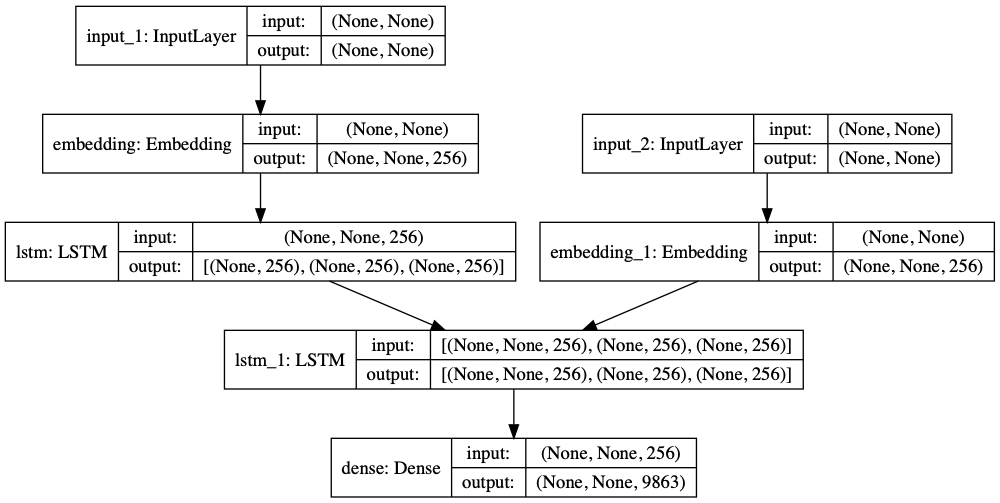

## keras-seq2seq



Use talk data of Facebook messenger and LINE for training data.

### HOW TO USE
```
$ git clone $(This repository's URL)
$ cd keras-att-seq2seq/

$ mv ~/Downloads/facebook-$(USER) ./raw/facebook
$ mkdir ./raw/line
$ mv ~/Downloads/\[LINE\]\ Chat\ with\ *.txt ./raw/line/

$ python parse.py
Parse facebook...
Parse line...
done.
$ python train.py
GPU: True
# Minibatch-size: 20
# embed_size: 100
# n_hidden: 100
# epoch: 200

Train
epoch: 1	tag: bigdata
	loss: 108549.05
	accuracy: 3658.35
	time: 0:04:13.800777
.
.
.
$ python decode.py
Interactive decode from ./result/30.npz
> お元気ですか？
元気です
>
```

#### Input data
```
data = [["query sentence", "response sentence"],
	["query sentence", "response sentence"],
	[..., ...], ...]
```

### Important
MeCabの辞書は，[mecab-ipadic-neologd](https://github.com/neologd/mecab-ipadic-neologd)を使用しました．
MeCab自体のインストールは，[mecab-ipadic-neologd](https://github.com/neologd/mecab-ipadic-neologd)を参考にしてください．

### parse.cpp
:warning: -lboost_filesystemオプションは，昔の記事だと，-lboost-filesystemとなっている場合が多いですが，-lboost_filesystemが正しいです．

**e.g. compile option**
```
$ g++ -std=c++1z -O3 -mtune=native -march=native -I/usr/local/Cellar/boost/1.66.0 -lboost_filesystem -lboost_system `mecab-config --cflags` `mecab-config --libs` -o parse parse.cpp
```

### Reference

paper : https://arxiv.org/abs/1409.3215
